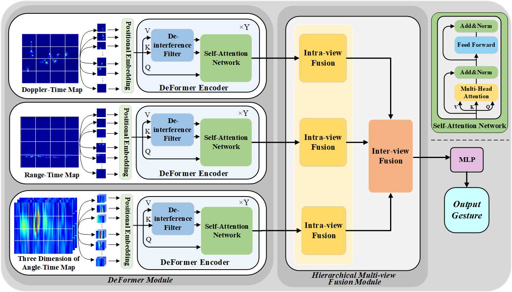
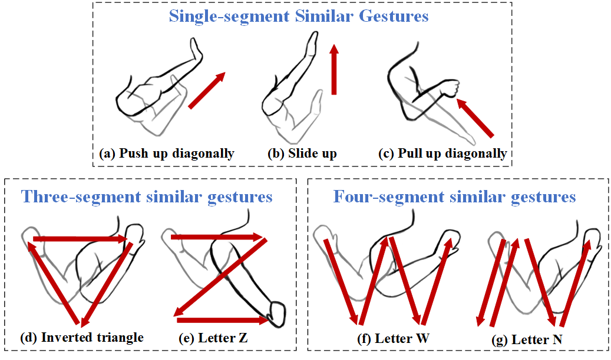
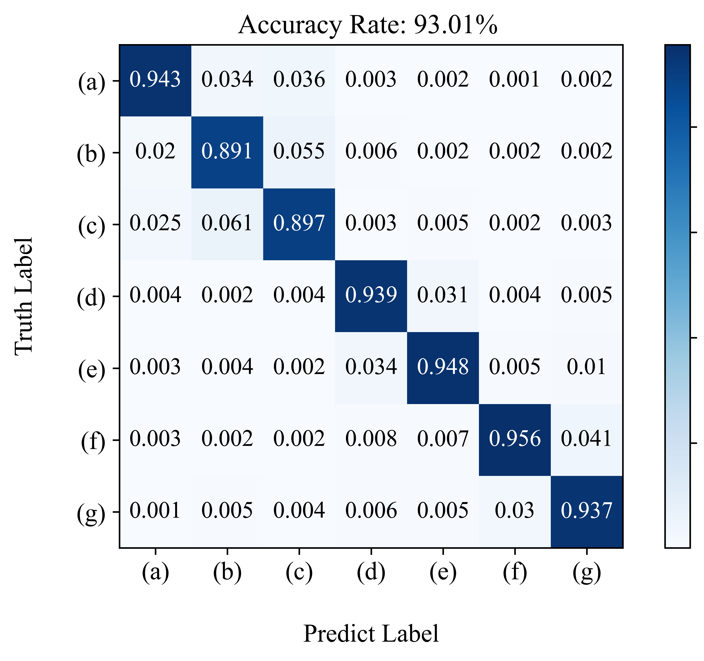

<!-- 关于本项目 -->
## MvDeFormer
Torch implementation for achieving accurate recognition of similar gestures under high-strength human activity interference, where a Multi-view De-interference Transformer (MvDeFormer) network is proposed as follows:


For indoor scenarios, human activities such as walking, running, or other unrelated behaviors very likely appear around the user, which would seriously affect the accuracy of gesture recognition. What's more, similar gestures are very difficult to distinguish with same number of segments or partially identical movements. So, in our experiments,  we considered the two issues mentioned above. Specifically, to deal with the strong human activity interference, we design a DeFormer module to capture the useful gesture features by learning different patterns between gestures and interference, thereby reducing the impact of interference. Then, we develop a hierarchical multi-view fusion module to first extract the enhanced features within each view, and effectively fuse them across various views for final recognition. The images of seven similar gestures and the recognition results by MvDeFormer are as follows:
<p align="center">
  
  
</p>

<p align="right">(<a href="#top">Reture to top</a>)</p>


### Setup

### Prerequisites
- Linux or Windows
- NVIDIA GPU + CUDA CuDNN (CPU mode and CUDA without CuDNN may work with minimal modification, but untested)

### Getting Started
- Install torch and dependencies from https://github.com/torch/distro
- Install torch packages tqdm, sklearn, einops and linformer
```bash
pip install tqdm
pip install -U scikit-learn
pip install einops
pip install linformer
```

你应该在这里列出项目使用的主要框架或库。附加组件和插件则应该放在致谢一节中。下面是一些例子。

* [Next.js](https://nextjs.org/)
* [React.js](https://reactjs.org/)
* [Vue.js](https://vuejs.org/)
* [Angular](https://angular.io/)
* [Svelte](https://svelte.dev/)
* [Laravel](https://laravel.com)
* [Bootstrap](https://getbootstrap.com)
* [JQuery](https://jquery.com)

<p align="right">(<a href="#top">返回顶部</a>)</p>


<!-- 开始 -->
## 开始

这是一份在本地构建项目的指导的例子。
要获取本地副本并且配置运行，你可以按照下面的示例步骤操作。

### 依赖

这只是一个列出软件依赖和安装方法的例子。
* npm
  ```sh
  npm install npm@latest -g
  ```

### 安装

_下面是一个指导你的受众如何安装和配置你的应用的例子。这个模板不需要任何外部依赖或服务。_

1. 在 [https://example.com](https://example.com) 获取一个免费的 API Key。
2. 克隆本仓库
   ```sh
   git clone https://github.com/your_username_/Project-Name.git
   ```
3. 安装 NPM 包
   ```sh
   npm install
   ```
4. 在 `config.js` 中填写你的 API
   ```js
   const API_KEY = '填写你的 API';
   ```

<p align="right">(<a href="#top">返回顶部</a>)</p>


<!-- 使用方法 示例 -->
## 使用方法

在这里你可以展示项目的使用方法。把附加的截图、代码示例和演示放在这里也很不错。你也可以用链接引用其他资源。

_转到 [文档](https://example.com) 查看更多示例_

<p align="right">(<a href="#top">返回顶部</a>)</p>


<!-- 路线图 -->
## 路线图

- [x] 添加更新日志
- [x] 添加「返回顶部」链接
- [ ] 添加额外的模板和示例
- [ ] 添加「组件」文档，以便更容易复制和粘贴各个部分
- [ ] 多语种支持
    - [x] 中文
    - [ ] 西班牙语

到 [open issues](https://github.com/othneildrew/Best-README-Template/issues) 页查看所有请求的功能 （以及已知的问题）。

<p align="right">(<a href="#top">返回顶部</a>)</p>


<!-- 贡献 -->
## 贡献

贡献让开源社区成为了一个非常适合学习、启发和创新的地方。你所做出的任何贡献都是**受人尊敬**的。

如果你有好的建议，请复刻（fork）本仓库并且创建一个拉取请求（pull request）。你也可以简单地创建一个议题（issue），并且添加标签「enhancement」。不要忘记给项目点一个 star！再次感谢！

1. 复刻（Fork）本项目
2. 创建你的 Feature 分支 (`git checkout -b feature/AmazingFeature`)
3. 提交你的变更 (`git commit -m 'Add some AmazingFeature'`)
4. 推送到该分支 (`git push origin feature/AmazingFeature`)
5. 创建一个拉取请求（Pull Request）

<p align="right">(<a href="#top">返回顶部</a>)</p>


<!-- 许可证 -->
## 许可证

根据 MIT 许可证分发。打开 [LICENSE.txt](LICENSE.txt) 查看更多内容。


<p align="right">(<a href="#top">返回顶部</a>)</p>


<!-- 联系我们 -->
## 联系我们

你的名字 - [@your_twitter](https://twitter.com/your_username) - email@example.com

项目链接: [https://github.com/your_username/repo_name](https://github.com/your_username/repo_name)

<p align="right">(<a href="#top">返回顶部</a>)</p>


<!-- 致谢 -->
## 致谢

在这里列出你觉得有用的资源，并以此致谢。我已经添加了一些我喜欢的资源，以便你可以快速开始！

* [Choose an Open Source License](https://choosealicense.com)
* [GitHub Emoji Cheat Sheet](https://www.webpagefx.com/tools/emoji-cheat-sheet)
* [Malven's Flexbox Cheatsheet](https://flexbox.malven.co/)
* [Malven's Grid Cheatsheet](https://grid.malven.co/)
* [Img Shields](https://shields.io)
* [GitHub Pages](https://pages.github.com)
* [Font Awesome](https://fontawesome.com)
* [React Icons](https://react-icons.github.io/react-icons/search)

<p align="right">(<a href="#top">返回顶部</a>)</p>


<!-- MARKDOWN 链接 & 图片 -->
<!-- https://www.markdownguide.org/basic-syntax/#reference-style-links -->
[contributors-shield]: https://img.shields.io/github/contributors/BreakingAwful/Best-README-Template-zh.svg?style=for-the-badge
[contributors-url]: https://github.com/BreakingAwful/Best-README-Template-zh/graphs/contributors
[forks-shield]: https://img.shields.io/github/forks/BreakingAwful/Best-README-Template-zh.svg?style=for-the-badge
[forks-url]: https://github.com/BreakingAwful/Best-README-Template-zh/network/members
[stars-shield]: https://img.shields.io/github/stars/BreakingAwful/Best-README-Template-zh.svg?style=for-the-badge
[stars-url]: https://github.com/BreakingAwful/Best-README-Template-zh/stargazers
[issues-shield]: https://img.shields.io/github/issues/BreakingAwful/Best-README-Template-zh.svg?style=for-the-badge
[issues-url]: https://github.com/BreakingAwful/Best-README-Template-zh/issues
[license-shield]: https://img.shields.io/github/license/BreakingAwful/Best-README-Template-zh.svg?style=for-the-badge
[license-url]: https://github.com/BreakingAwful/Best-README-Template-zh/blob/master/LICENSE.txt
[linkedin-shield]: https://img.shields.io/badge/-LinkedIn-black.svg?style=for-the-badge&logo=linkedin&colorB=555
[linkedin-url]: https://linkedin.com/in/othneildrew
[MvDeFormer]: images/MvDeFormer.png
[Gesture]: images/gesture.png
[ConfusionMatrix]: images/ConfusionMatrix.png
